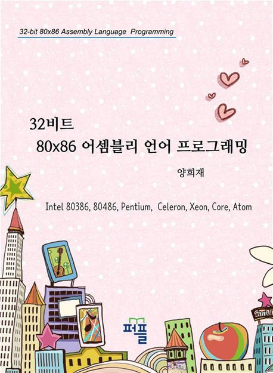

 

### 32비트 80x86 어셈블리 언어 프로그래밍

#### 7장
- [7.4.5 실습](/Chapter07/Training7.4.5/)
- [7.5.4 실습](/Chapter07/Training7.5.4/)
- [7.7.3 실습](/Chapter07/Exercise7.7.3/)
- [7.10.4 실습](/Chapter07/Exercise7.10.4/)
 

- [7.6.6 연습](/Chapter07/Exercise7.6.6/)
- [7.11.1 연습](/Chapter07/Exercise7.11.1/)
- [7.11.2 연습](/Chapter07/Exercise7.11.2/)
- [7.11.3 연습](/Chapter07/Exercise7.11.3/)
- [7.11.4 연습](/Chapter07/Exercise7.11.4/)
- [7.11.5 연습](/Chapter07/Exercise7.11.5/)
- [7.11.6 연습](/Chapter07/Exercise7.11.6/)
- [7.11.7 연습](/Chapter07/Exercise7.11.7/)
- [7.11.8 연습](/Chapter07/Exercise7.11.8/)
- [7.11.9 연습](/Chapter07/Exercise7.11.9/)
- [7.11.10 연습](/Chapter07/Exercise7.11.10/)
- [7.11.11 연습](/Chapter07/Exercise7.11.11/)
- [7.11.12 연습](/Chapter07/Exercise7.11.12/)
- [7.11.13 연습](/Chapter07/Exercise7.11.13/)
- [7.11.14 연습](/Chapter07/Exercise7.11.14/)
- [7.11.15 연습](/Chapter07/Exercise7.11.15/)
- [7.11.16 연습](/Chapter07/Exercise7.11.16/)
- [7.11.17 연습](/Chapter07/Exercise7.11.17/)
- [7.11.20 연습](/Chapter07/Exercise7.11.20/)
- [7.11.21 연습](/Chapter07/Exercise7.11.21/)
- [7.11.22 연습](/Chapter07/Exercise7.11.22/)
- [7.11.23 연습](/Chapter07/Exercise7.11.23/)